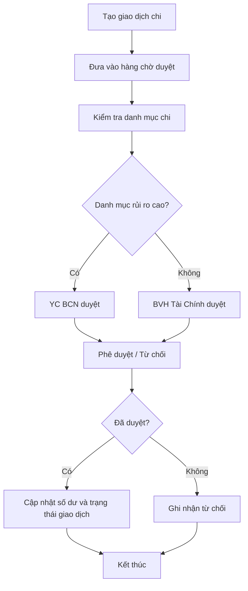

# Expense Approval Flow

## Mục đích
Đặc tả quy trình duyệt chi dựa trên policy danh mục và vai trò phê duyệt.

## Điểm kiểm soát
- Không cho duyệt nếu thiếu quyền.
- Xoá mềm để giữ lịch sử.
- Đồng bộ trạng thái với dashboard và logs.
