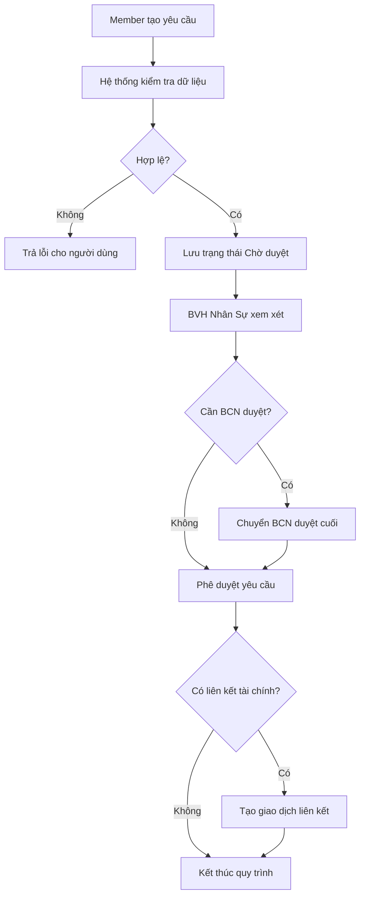

# Request Approval Flow

## Mục đích
Mô tả luồng xử lý từ lúc tạo yêu cầu đến khi hệ thống hoàn tất duyệt và sinh giao dịch liên quan nếu cần.

## Điểm kiểm soát
- Kiểm tra quyền người tạo.
- Kiểm tra trạng thái nháp hay đã gửi.
- Tạo audit log cho mọi bước thay đổi trạng thái.
