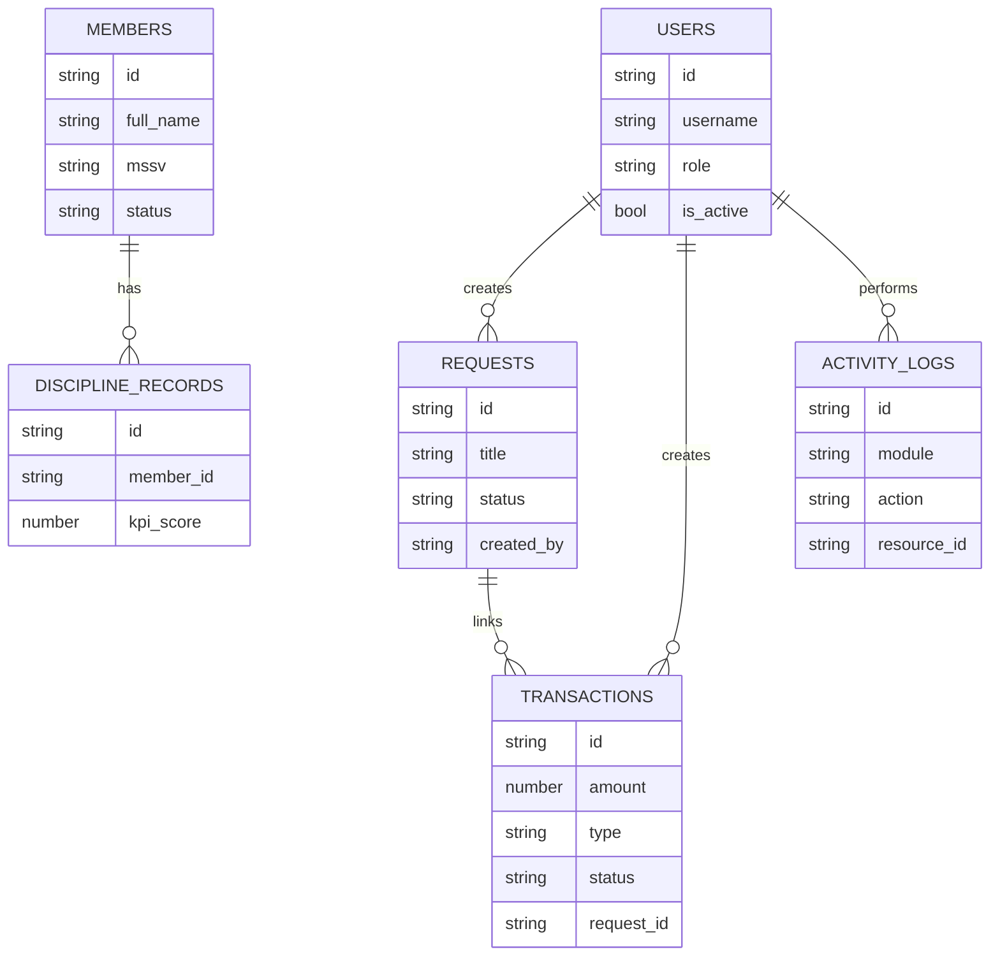

# ERD

```mermaid
erDiagram
    USERS ||--o{ REQUESTS : creates
    USERS ||--o{ TRANSACTIONS : creates
    MEMBERS ||--o{ DISCIPLINE_RECORDS : has
    REQUESTS ||--o{ TRANSACTIONS : links
    USERS ||--o{ ACTIVITY_LOGS : performs

    USERS {
      string id
      string username
      string role
      bool is_active
    }

    MEMBERS {
      string id
      string full_name
      string mssv
      string status
    }

    REQUESTS {
      string id
      string title
      string status
      string created_by
    }

    TRANSACTIONS {
      string id
      number amount
      string type
      string status
      string request_id
    }

    DISCIPLINE_RECORDS {
      string id
      string member_id
      number kpi_score
    }

    ACTIVITY_LOGS {
      string id
      string module
      string action
      string resource_id
    }
```

## Mục đích
Phác thảo mô hình dữ liệu mức bảng cho các thực thể chính của hệ thống.
