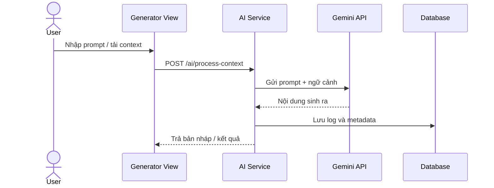

# AI Insight Sequence Diagram

```mermaid
sequenceDiagram
    actor User
    participant UI as Generator View
    participant API as AI Service
    participant GEM as Gemini API
    participant DB as Database

    User->>UI: Nhập prompt / tải context
    UI->>API: POST /ai/process-context
    API->>GEM: Gửi prompt + ngữ cảnh
    GEM-->>API: Nội dung sinh ra
    API->>DB: Lưu log và metadata
    API-->>UI: Trả bản nháp / kết quả
```

## Mục đích
Mô tả chuỗi xử lý từ ngữ cảnh đầu vào đến kết quả AI và log lưu trữ.
