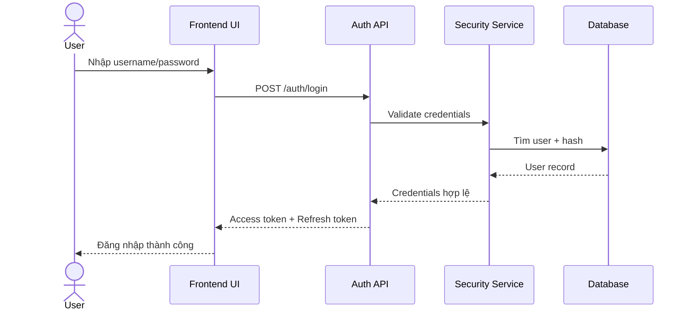

# Auth Flow Sequence Diagram

```mermaid
sequenceDiagram
    actor User
    participant UI as Frontend UI
    participant API as Auth API
    participant SEC as Security Service
    participant DB as Database

    User->>UI: Nhập username/password
    UI->>API: POST /auth/login
    API->>SEC: Validate credentials
    SEC->>DB: Tìm user + hash
    DB-->>SEC: User record
    SEC-->>API: Credentials hợp lệ
    API-->>UI: Access token + Refresh token
    UI-->>User: Đăng nhập thành công
```

## Mục đích
Mô tả tương tác cấp đăng nhập giữa frontend, auth service và database.
