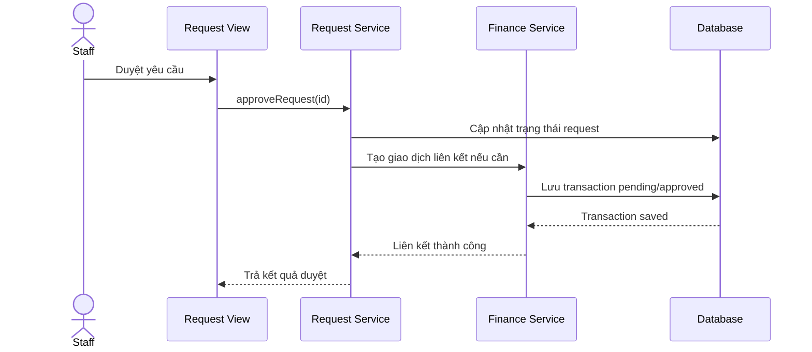

# Request to Finance Sequence Diagram

```mermaid
sequenceDiagram
    actor Staff
    participant UI as Request View
    participant REQ as Request Service
    participant FIN as Finance Service
    participant DB as Database

    Staff->>UI: Duyệt yêu cầu
    UI->>REQ: approveRequest(id)
    REQ->>DB: Cập nhật trạng thái request
    REQ->>FIN: Tạo giao dịch liên kết nếu cần
    FIN->>DB: Lưu transaction pending/approved
    DB-->>FIN: Transaction saved
    FIN-->>REQ: Liên kết thành công
    REQ-->>UI: Trả kết quả duyệt
```

## Mục đích
Mô tả cách request được duyệt và có thể sinh transaction liên kết trong cùng một luồng nghiệp vụ.
