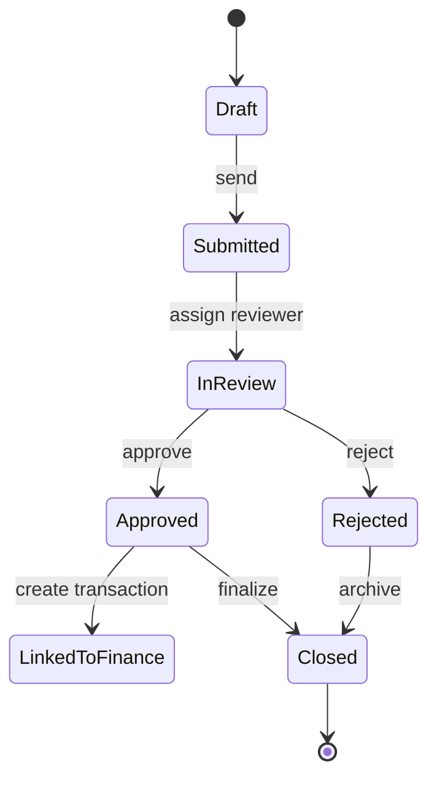

# Request Lifecycle

```mermaid
stateDiagram-v2
    [*] --> Draft
    Draft --> Submitted: send
    Submitted --> InReview: assign reviewer
    InReview --> Approved: approve
    InReview --> Rejected: reject
    Approved --> LinkedToFinance: create transaction
    Approved --> Closed: finalize
    Rejected --> Closed: archive
    Closed --> [*]
```

## Mục đích
Mô tả vòng đời của một Request từ nháp đến đóng hồ sơ.

## Trạng thái chính
- Draft
- Submitted
- InReview
- Approved
- Rejected
- Closed
