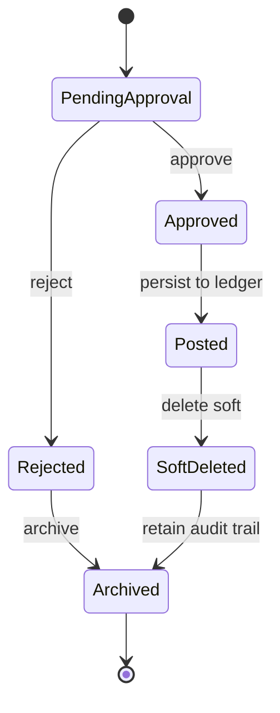

# Transaction Lifecycle

## Mục đích
Mô tả vòng đời của giao dịch tài chính và cách xoá mềm được giữ lại để audit.

## Trạng thái chính
- PendingApproval
- Approved
- Posted
- SoftDeleted
- Archived
- Rejected
