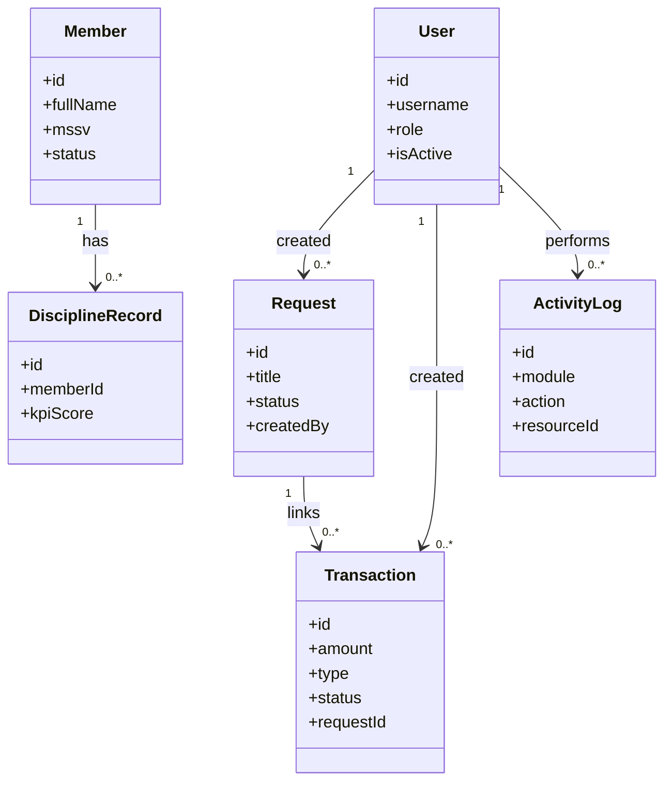

# Class Diagram

```mermaid
classDiagram
    class User {
      +id
      +username
      +role
      +isActive
    }

    class Member {
      +id
      +fullName
      +mssv
      +status
    }

    class Request {
      +id
      +title
      +status
      +createdBy
    }

    class Transaction {
      +id
      +amount
      +type
      +status
      +requestId
    }

    class DisciplineRecord {
      +id
      +memberId
      +kpiScore
    }

    class ActivityLog {
      +id
      +module
      +action
      +resourceId
    }

    User "1" --> "0..*" Request : created
    User "1" --> "0..*" Transaction : created
    Member "1" --> "0..*" DisciplineRecord : has
    Request "1" --> "0..*" Transaction : links
    User "1" --> "0..*" ActivityLog : performs
```

## Mục đích
Tóm tắt các thực thể chính và quan hệ cốt lõi giữa chúng ở mức thiết kế dữ liệu.
