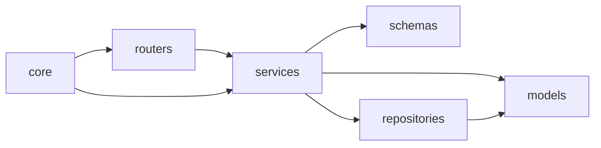

# Package Diagram

```mermaid
flowchart LR
    core[core]
    routers[routers]
    models[models]
    schemas[schemas]
    services[services]
    repositories[repositories]

    routers --> services
    services --> repositories
    services --> models
    services --> schemas
    repositories --> models
    core --> routers
    core --> services
```

## Mục đích
Mô tả lớp kiến trúc backend theo kiểu phân lớp để dễ bảo trì và mở rộng.
