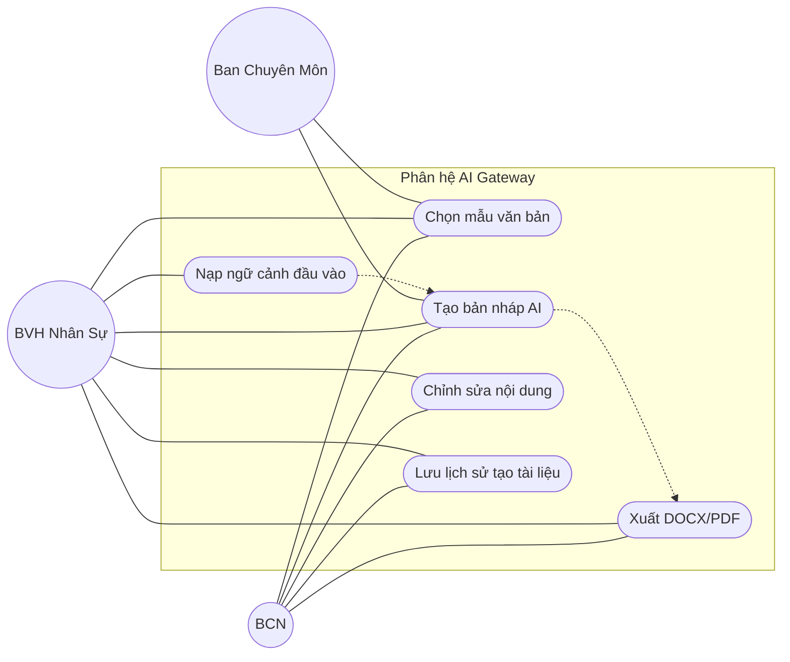

# AI Gateway Use Case Diagram

# Phân tích tác nhân (Actors)

- **BCN**: sử dụng công cụ tạo văn bản cho công việc điều hành chung.
- **BVH Nhân Sự**: soạn thảo và xử lý các biểu mẫu hành chính.
- **Ban Chuyên Môn**: có thể xem hoặc dùng theo quyền được cấp.

# Danh sách Use Case

- Chọn mẫu văn bản.
- Nạp ngữ cảnh từ file hoặc Google Sheets.
- Tạo bản nháp bằng AI.
- Chỉnh sửa nội dung đã sinh.
- Xuất văn bản ra DOCX/PDF.
- Lưu lịch sử tạo tài liệu.

# RBAC Matrix

| Use Case | Actor cho phép | Ghi chú nghiệp vụ |
|---|---|---|
| Chọn mẫu văn bản | BCN, BVH Nhân Sự, Ban Chuyên Môn được cấp quyền | Mẫu dùng để chuẩn hóa đầu ra. |
| Nạp ngữ cảnh đầu vào | BCN, BVH Nhân Sự | Hỗ trợ file upload hoặc link dữ liệu. |
| Tạo bản nháp AI | BCN, BVH Nhân Sự, quyền được cấp | Cần giới hạn rate limit cho endpoint AI. |
| Xuất DOCX/PDF | BCN, BVH Nhân Sự | Có thể xuất theo template đã chọn. |
| Lưu lịch sử | Hệ thống | Phục vụ audit và truy vết nội dung. |
