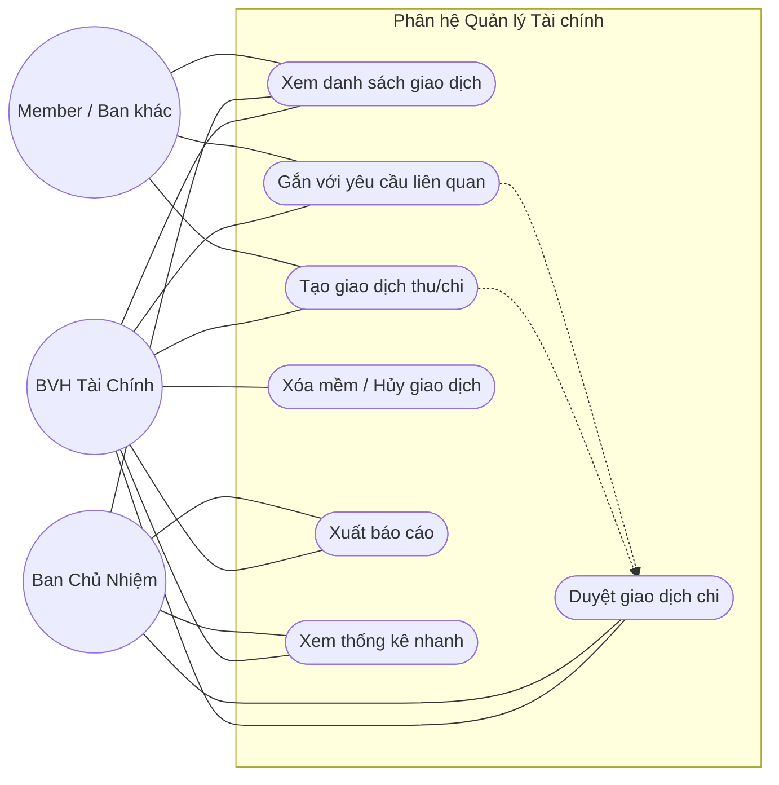

# Finance Management Use Case Diagram

# Phân tích tác nhân (Actors)

- **BVH Tài Chính**: quản lý quỹ, nhập giao dịch và xử lý duyệt chi thường kỳ.
- **BCN**: duyệt các giao dịch vượt hạn mức hoặc rủi ro cao.
- **Member / Ban khác**: tạo yêu cầu chi hoặc theo dõi trạng thái theo quyền.

# Danh sách Use Case

- Xem bảng điều khiển tài chính.
- Xem danh sách giao dịch.
- Tạo giao dịch thu / chi.
- Gắn giao dịch với yêu cầu liên quan.
- Duyệt giao dịch chi.
- Hủy hoặc xóa mềm giao dịch theo chính sách.
- Xuất báo cáo giao dịch.
- Xem thống kê quỹ nhanh.

# RBAC Matrix

| Use Case | Actor cho phép | Ghi chú nghiệp vụ |
|---|---|---|
| Xem danh sách / chi tiết | BVH Tài Chính, BCN | Member chỉ xem dữ liệu liên quan nếu được cấp quyền. |
| Tạo giao dịch | BVH Tài Chính, Member / Ban khác | Member chỉ được tạo yêu cầu trong phạm vi cho phép. |
| Duyệt giao dịch chi | BVH Tài Chính, BCN | BCN xử lý các khoản vượt hạn mức. |
| Xóa mềm / hủy giao dịch | BVH Tài Chính, BCN | Phải giữ audit trail. |
| Xuất báo cáo | BVH Tài Chính, BCN | Nên hỗ trợ lọc trước khi xuất. |
