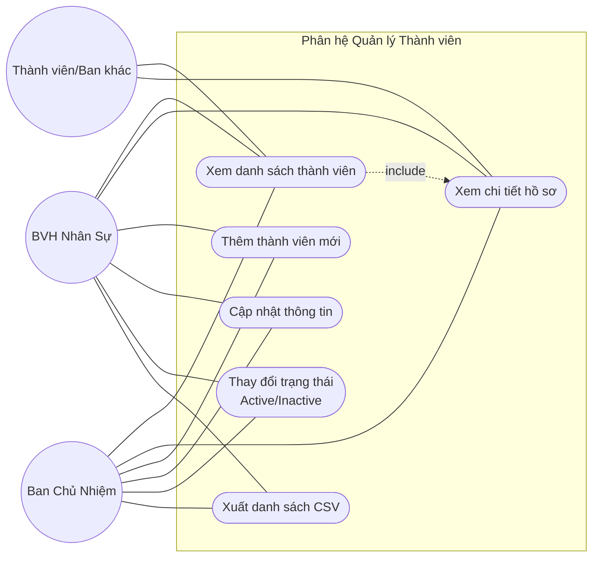

#uml #use-case
```table-of-contents
```
# Phân tích Tác nhân (Actors)

# List of Use Case
- **Xem danh sách thành viên:** Cho phép tìm kiếm theo tên/MSSV, lọc theo Ban hoặc Trạng thái.
- **Xem chi tiết thành viên:** Xem đầy đủ thông tin cá nhân, kỹ năng và định hướng của một thành viên cụ thể.
- **Thêm thành viên:** Khởi tạo hồ sơ mới dựa trên MSSV duy nhất.
- **Cập nhật thông tin:** Chỉnh sửa các trường thông tin (ngoại trừ MSSV).
- **Cập nhật trạng thái:** Chuyển đổi trạng thái giữa `Active` và `Inactive`.
- **Xuất dữ liệu (Export):** Trích xuất danh sách thành viên ra file CSV.


# RBAC Matrix
|**Use Case**|**Actor cho phép**|**Ghi chú nghiệp vụ**|
|---|---|---|
|**Xem danh sách/Chi tiết**|Tất cả các Role (BCN, HR, Finance, Logistics, Member...)|Phục vụ tra cứu nội bộ.|
|**Thêm thành viên**|BCN, BVH_HR|Kiểm tra trùng lặp MSSV và ghi Audit Log.|
|**Cập nhật thông tin**|BCN, BVH_HR|Không được phép sửa MSSV.|
|**Cập nhật trạng thái**|BCN, BVH_HR|Chỉ chấp nhận giá trị `Active` hoặc `Inactive`.|
|**Xuất dữ liệu CSV**|BCN, BVH_HR|Hỗ trợ lọc theo Ban/Trạng thái trước khi xuất.|

