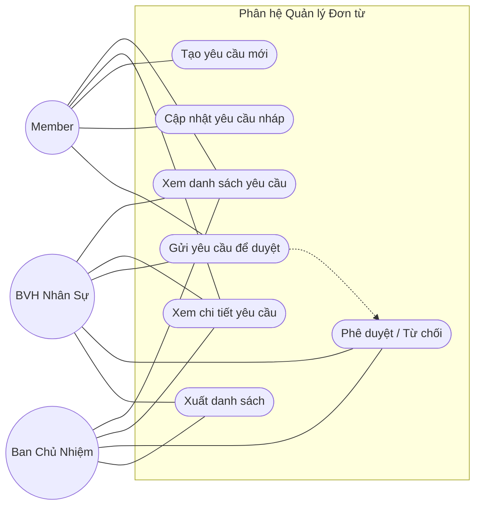

# Request Management Use Case Diagram

# Phân tích tác nhân (Actors)

- **Member**: tạo và theo dõi các yêu cầu của cá nhân hoặc ban mình.
- **BVH Nhân Sự**: tiếp nhận, xử lý và duyệt các yêu cầu hành chính.
- **BCN**: duyệt cuối cùng cho các trường hợp vượt thẩm quyền.

# Danh sách Use Case

- Xem danh sách yêu cầu.
- Xem chi tiết yêu cầu.
- Tạo yêu cầu mới.
- Cập nhật yêu cầu khi còn ở trạng thái nháp.
- Gửi yêu cầu để duyệt.
- Phê duyệt hoặc từ chối yêu cầu.
- Xuất danh sách yêu cầu.
- Liên kết yêu cầu với giao dịch tài chính hoặc xử lý hậu cần khi cần.

# RBAC Matrix

| Use Case | Actor cho phép | Ghi chú nghiệp vụ |
|---|---|---|
| Xem danh sách/chi tiết | BCN, BVH Nhân Sự, Member liên quan | Chỉ hiển thị dữ liệu trong phạm vi được phép. |
| Tạo yêu cầu | BCN, BVH Nhân Sự, Member | Chỉ tạo trong phạm vi cá nhân hoặc ban mình. |
| Cập nhật yêu cầu nháp | BCN, BVH Nhân Sự, Member | Không cho sửa sau khi đã gửi duyệt. |
| Gửi yêu cầu | BCN, BVH Nhân Sự, Member | Tạo trạng thái chờ duyệt. |
| Phê duyệt/Từ chối | BVH Nhân Sự, BCN | BCN xử lý cuối cùng với ca vượt hạn mức. |
| Xuất dữ liệu | BCN, BVH Nhân Sự | Có thể áp dụng lọc trước khi xuất. |
